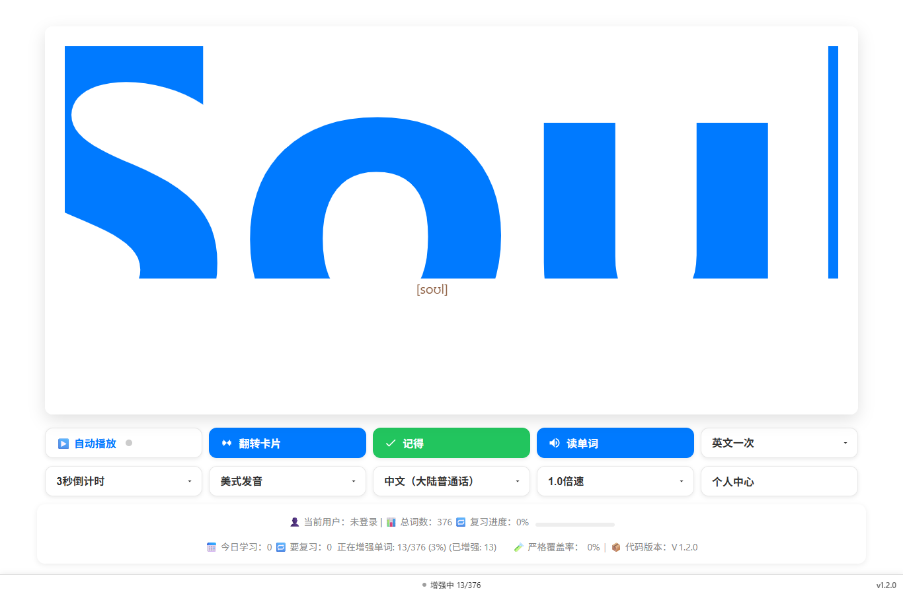
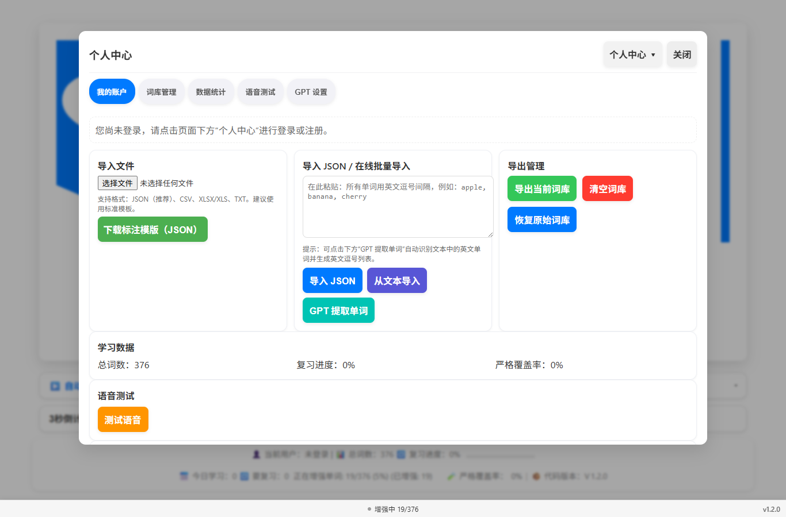
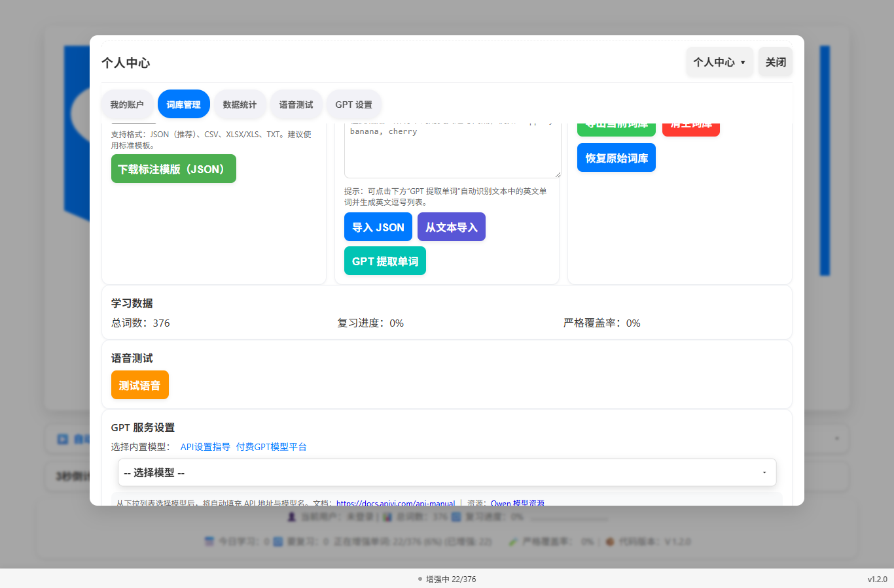
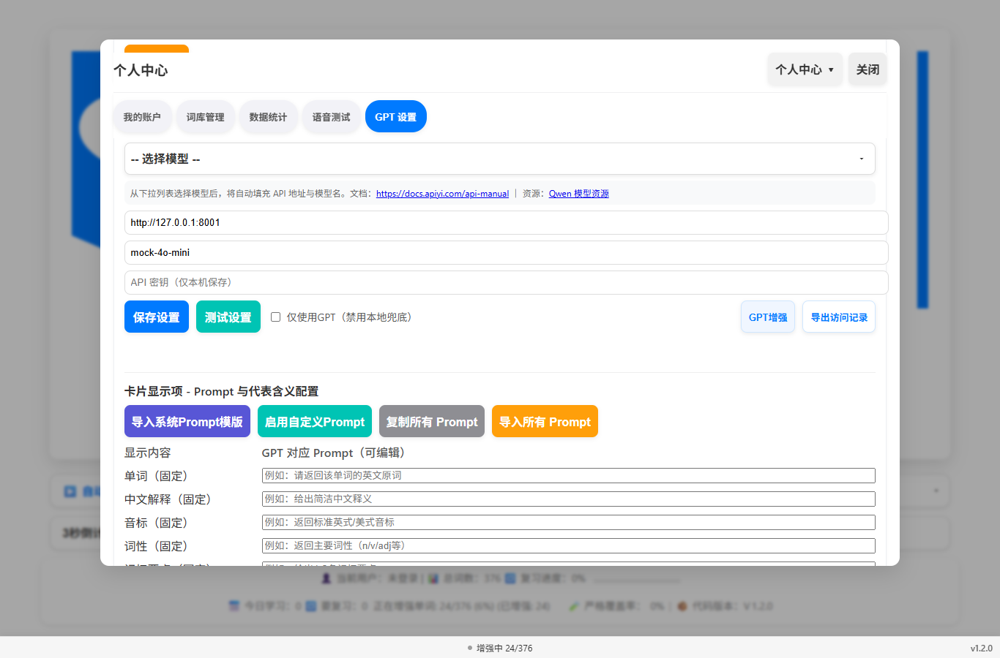
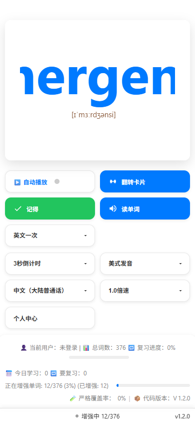
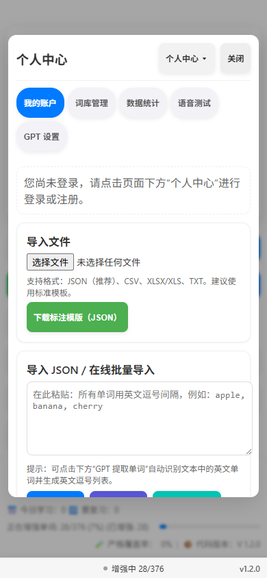

# GoldWord 🪙


[](#)
[](#)
[](#)
[](#)
[](#)

> **中文版: [README.md](README.md) / English (this page)**

## Every remembered word is a coin.

GoldWord is an **offline-first**, lightweight English vocabulary learning and review app: a fully static, **zero-backend** web app with all data stored locally. It turns memorization into "wealth building" — every review cycle grows your personal word vault.

The all-new **v1.2.0** redesigned the **Personal Center** into a **single-page layout**: all settings on one scrollable page, panel width at 80% of the screen, responsive multi-column word-management cards, plus chapter quick-jump navigation with scroll highlighting.

---

## Screenshots

| Desktop home | Personal Center (single page / top) |
| --- | --- |
|  |  |

| Word management (responsive columns) | GPT settings |
| --- | --- |
|  |  |

| Mobile home | Mobile Personal Center |
| --- | --- |
|  |  |

> Screenshots live under `www/docs/screenshots/` and are regenerated per release.

---

## Features

- **Flashcard learning**: flip / next / speak / remember / don't remember / auto-play, with keyboard shortcuts.
- **Eight-dimension memory fields**: word, Chinese meaning, phonetic, part of speech, memory tip, association, main definition/usage, brief, collocations, examples.
- **Vocabulary import**: `JSON`, `CSV`, `XLSX/XLS`, `TXT` (parsed in-browser, nothing is uploaded); plus **GPT word extraction** from pasted text.
- **Export & backup**: export the current dictionary, restore the original one-click, clear the dictionary.
- **Study statistics**: total words, review progress, strict coverage; when logged in also 30-day / 24-hour study, overall progress and daily goal.
- **GPT enrichment**: pick a built-in model preset or configure a custom `Base URL / Model / API Key` to generate/enrich word cards; "GPT-only mode" disables the local fallback.
- **Custom field prompts**: every card field exposes its own editable GPT prompt with import/copy/enable-all controls.
- **Voice test**: built-in TTS speech test.
- **Multi-language UI**: 中文 / English / ภาษาไทย / 日本語 / Español.
- **User system**: register/login with 4-digit PIN, per-user data isolation, plus a hidden admin account (user management: create, reset password, delete, ban).
- **Offline-first PWA**: Service Worker caches assets; works after first load without a network (except GPT online features).
- **Version self-check**: `vX.Y.Z` shown in the status bar and "Code Version" chip; click for local / latest / macOS version details.

---

## Architecture

### Design overview

GoldWord is a **fully static, backend-free** browser app. All logic runs client-side; data never leaves the device:

```txt
┌──────────────────────────────────────────────────────────────┐
│                          Browser (PWA)                       │
│                                                              │
│  ┌────────────┐   ┌────────────┐   ┌──────────────────────┐  │
│  │ index.html │   │  ui.js     │   │  app.js              │  │
│  │ (app shell)│──▶│ (UI/events)│──▶│ (study flow)         │  │
│  └────────────┘   └────────────┘   └──────────────────────┘  │
│        │                                  │                  │
│        ▼                                  ▼                  │
│  ┌──────────────── Business modules ───────────────────┐     │
│  │ storage.js    local storage adapter (SA)            │     │
│  │ db.js         words/records/users/stats + GPT cfg   │     │
│  │ word-schema.js    word record structure             │     │
│  │ word-enhancement-service.js  GPT enrichment         │     │
│  │ built-in-words.js / local-dictionary                │     │
│  │ built-in-models.js   built-in GPT model presets     │     │
│  │ visit-backup.js      study-record export            │     │
│  └─────────────────────────────────────────────────────┘     │
│        │                                                      │
│        ├──────────────▶  IndexedDB / localStorage (local)      │
│        ├──────────────▶  i18n.js (multi-language, localStorage)│
│        └──────────────▶  version.js (version self-check)       │
└──────────────────────────────────────────────────────────────┘
        │
        └── (optional, online) → GPT API (Base URL user-configured)
```

### Directory structure (`www/` is the single publish source)

```txt
GoldWord
├── www/                          # Sole web publish source (single-source)
│   ├── index.html                # App shell: cards + menu bar + Personal Center + auth overlays
│   ├── ui.js                     # UI init, event binding, card animation, Personal Center, i18n
│   ├── app.js                    # Bootstrap, study flow, import parsing, SW register, GPT settings
│   ├── storage.js                # SA local storage adapter (localStorage wrapper)
│   ├── db.js                     # Dictionary/records/users/stats + GPT config (gpt_config__<userId>)
│   ├── word-schema.js            # Word record fields/defaults/validation
│   ├── word-enhancement-service.js   # GPT word enrichment & field-prompt service
│   ├── built-in-words.js         # Built-in starter vocabulary
│   ├── built-in-models.js        # Built-in GPT model presets (auto-fill API URL/model name)
│   ├── local-dictionary.json     # Offline dictionary fallback
│   ├── i18n.js                   # UI copy dictionaries & language switching
│   ├── language-system.json      # Multi-language metadata
│   ├── visit-backup.js           # Study/visit data export backup
│   ├── version.js                # Version resolve & display (reads version.json/latest.json)
│   ├── version.json              # Local current version (v1.2.0)
│   ├── downloads/latest.json     # Latest-version broadcast
│   ├── docs/
│   │   ├── version-mac.json      # macOS package version metadata
│   │   └── screenshots/          # Screenshots used by this README
│   ├── api-settings-guide.html   # Standalone API setup guide page
│   ├── service-worker.js         # PWA offline cache
│   ├── manifest.json             # PWA manifest (icons/theme/standalone)
│   └── icons/                    # App icons (svg/png)
├── netlify.toml                  # Netlify build config (publishes www/)
└── README.md / README.en.md      # Docs — Chinese / English
```

### Data flow (one study loop)

1. `app.js` boots → loads the current user's dictionary via `db.js` → `ui.js` renders the first card.
2. Flip → eight-dimension fields revealed; Remember / Don't remember → `db.js` updates markers & stats.
3. Speak → system TTS; Auto-play → timed loop.
4. Personal Center opens the settings panel (single page with quick-jump chapters).
5. From the panel: import/export/clear the dictionary, configure GPT, test voice, view statistics.

### Storage design (all local)

| Key | Purpose | Location |
| --- | --- | --- |
| `gk_users` | User table (id/name/password) | localStorage |
| `gk_current_user` | Currently signed-in user | localStorage |
| `gpt_config__<userId>` | Per-user GPT config | localStorage |
| `appLanguage` | UI language | localStorage |
| dictionary / records / stats | Persisted via SA adapter | localStorage/IndexedDB |

### Multi-language mechanism

- Locale codes: `zh-CN` / `en-US` (UI switcher offers 中文 / English / ภาษาไทย / 日本語 / Español).
- Copy lives in `i18n.js` and `language-system.json`, rendered through `data-i18n` keys.
- The choice is stored in `localStorage.appLanguage`; refresh to apply.

---

## Quick start (local preview)

```bash
# Option 1: static server (recommended — keeps PWA/SW working)
cd www
python -m http.server 8000          # or python3; works on Windows too
# open http://localhost:8000/

# Option 2: deploy www/ to any static host (Netlify Drop, GitHub Pages, Vercel, ...)
```

---

## Settings guide (Personal Center · v1.2.0 single page)

> Open: click **Personal Center** in the bottom menu bar. Panel width is 80% of the screen on desktop and shrinks to 94% on mobile. All chapters are visible on one page; the chapter-jump chips smooth-scroll and highlight the active section.

### 1. My Account
- **Register / Login** (when signed out): account may be Chinese/English/email; register uses a 4-digit PIN, login uses the PIN (or the admin password).
- **User info** (signed in): 30-day study, 24-hour study, overall progress, daily goal.
- **Admin panel** (admin only, see below).
- **UI language**: the "Personal Center ▾" dropdown switches 中文 / English / ภาษาไทย / 日本語 / Español.

### 2. Word Management
- **Import file**: pick `JSON/CSV/XLSX/XLS/TXT` (parsed locally in-browser).
- **Download standard template**: recommended JSON template.
- **Import JSON / online batch import**: paste a comma-separated word list; or click **GPT Extract** to let GPT detect English words in your text.
- **Import from text**: parses tagged lines (Chinese/phonetic/part of speech/definition/collocation/memory tip, etc.).
- **Export management**: export current dictionary, clear dictionary, restore original dictionary.

### 3. Statistics
- Total words, review progress, strict coverage (responsive multi-column on wide screens).

### 4. Voice Test
- Click "Test Voice" to verify system TTS availability.

### 5. GPT Settings
- **Built-in model**: pick a model from the dropdown → API URL and model name auto-fill.
- **Custom**: `Base URL`, `Model`, `API Key` (stored locally only).
- **Save / Test**: saved to `gpt_config__<userId>`; test runs a minimal connectivity check.
- **GPT-only mode**: when checked, the local fallback is disabled.
- **GPT enhance / Export visits**: quick actions and study-record export backup.
- **Field prompt config**: each card field (word/chinese/phonetic/pos/memory/association/definition/brief/collocation/example) has an editable prompt; supports import system prompt template / enable custom prompts / copy all prompts / import all prompts.

### Admin account
- The admin is a **hidden account** (`caishen`) with no UI hint; it requires the account-bound special password to sign in.
- Once signed in, "My Account" shows the admin panel: view users, create/update users, reset passwords, delete and ban.
- Deleting a user also removes their `gpt_config__<userId>`.

---

## Deployment

### Netlify (pre-configured)
`netlify.toml` is already in the repo — build command `cp -r www/. .`, publish directory `.`:

```bash
npx netlify-cli deploy --prod --dir=www
```

### GitHub Pages / any static host
- Publish the contents of `www/` to your site root (you may also push the `gh-pages` branch).
- In-app version self-check depends on `version.json` and `downloads/latest.json` — update them with every release.

---

## Versioning

- Semantic versioning `vX.Y.Z`; keep `version.json` and `downloads/latest.json` in sync.
- `version.js` reads and renders the version into the status bar and the "Code Version" chip.

### Changelog

| Version | Date | Notes |
| --- | --- | --- |
| **1.2.0** | 2026-09 | Personal Center redesigned to a single-page layout (80% screen width); responsive multi-column word-management cards; chapter quick-jump + scroll highlight; adaptive statistics columns |
| 1.1.0 | 2026-09 | Version display rework (`vX.Y.Z` status + code-version chip + detail overlay); `www/` single-source convergence; restored built-in dictionary/templates |
| 1.0.x | 2025 | Core features: flashcard study, import/export, GPT config, multi-language, login/stats, offline PWA |

---

## Development

- Edit files under `www/` directly; no build step required.
- Local preview: `cd www && python -m http.server 8000`.
- Bump the version: edit `www/version.json` and `www/downloads/latest.json`.
- Refresh screenshots and save them under `www/docs/screenshots/`.

---

## FAQ

- **Statistics don't refresh after import**: reopen the Personal Center.
- **GPT unavailable offline**: expected behavior; local study keeps working.
- **Some copy doesn't change after language switch**: refresh the page.
- **Admin panel not showing**: sign in again with the hidden admin account (`caishen`).

## Security notes

- API keys are kept only in local `localStorage`; never commit them.
- This repository contains no certificates, private keys, or secrets.